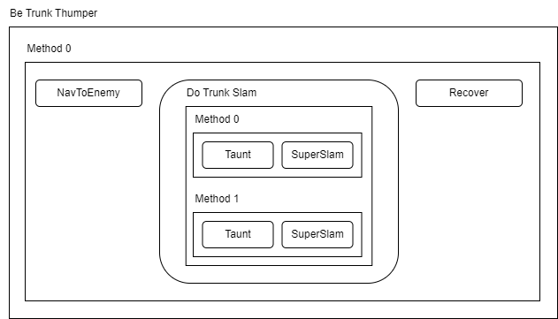
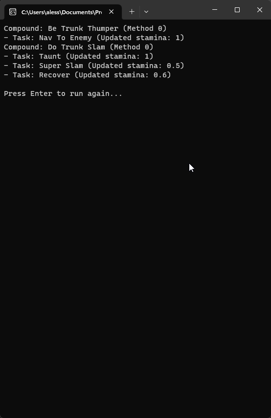

# Hierarchical Task Network
## The Theory
### What is it?
A Hierarchical Task Network (HTN) is an AI planning technique used to model complex tasks and decision-making processes.
It represents a problem domain as a hierarchical structure of tasks, where higher-level tasks are decomposed into subtasks until the lowest-level tasks are simple and executable actions.
This hierarchical representation allows for efficient planning and decision-making by breaking down complex problems into manageable subproblems.
### When should it be used?
HTNs are particularly useful when dealing with tasks that have a hierarchical structure and can be decomposed into smaller, more manageable subtasks.
They excel in scenarios where there are multiple possible plans or strategies to achieve a goal, and an AI agent needs to make informed decisions based on the current state of the environment and its capabilities.
### When should it not be used?
HTNs might not be the best choice for simple tasks or scenarios where the problem domain is relatively straightforward and does not involve hierarchical decomposition.
If the task can be solved efficiently using linear planning methods or if there is little complexity in the action space, using an HTN might introduce unnecessary overhead.
### What are the common pitfalls of this approach?
Some common pitfalls of using HTNs include:
* Overhead in Decomposition: If the hierarchy becomes too deep or involves excessive decomposition, it can lead to unnecessary computational overhead, impacting the efficiency of the planning process.
* Inefficient Hierarchies: Designing an optimal hierarchy can be challenging, and suboptimal hierarchies may lead to suboptimal or inefficient plans.
* Difficulty in Representing Continuous Actions: HTNs are better suited for discrete actions, and representing continuous actions in the hierarchy can be cumbersome and less effective.
* Handling Uncertainty: HTNs may struggle to handle uncertainty or dynamic changes in the environment effectively, as their hierarchical nature may not accommodate real-time adaptability.
## The Practice
### Sample Project
This sample project structures a HTN as in the diagram:

Running the tree with an initial Stamina value of 1 produces the outcome shown below:

