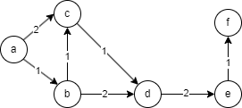

# A*
## The Theory
### What is it?
The A* algorithm is a widely used search algorithm in computer science and artificial intelligence.
It is primarily employed in pathfinding and graph traversal problems to find the shortest path between two points in a weighted graph.
A* efficiently combines Dijkstra's algorithm's Breadth-First Search with a heuristic function that guides the search towards the goal node, making it more efficient in finding the optimal path.
### When should it be used?
The A* algorithm is well-suited for problems that involve finding the shortest path or the most efficient route between two points in a graph with varying costs.
It is commonly used in video games for AI navigation, robotics for path planning, and network routing for finding optimal routes between locations.
### When should it not be used?
A* might not be the best choice when dealing with graphs that have negative edge weights or inconsistent heuristics.
In such cases, A* may not guarantee finding the shortest path, and other algorithms like Dijkstra's algorithm or Bellman-Ford may be more suitable.
Additionally, if the problem domain involves finding all possible paths or a combination of multiple objectives, other algorithms like Depth-First Search or multi-objective search might be more appropriate.
### What are the common pitfalls of this approach?
Some common pitfalls of using the A* algorithm include:
* Inaccurate Heuristics: If the heuristic function used in A* is not admissible or consistent, the algorithm might not find the optimal path, and the performance may degrade significantly.
* Memory Intensive: A* requires storing and managing a priority queue of nodes, making it memory-intensive, especially in large graphs with many nodes.
* Tie-breaking: If multiple paths have the same f-value (cost from the start node to the goal through a given node), tie-breaking rules need to be well-defined to ensure consistency in the path selected.
## The Practice
### Sample Project
This sample project structures a graph as in the diagram:

The order of traversal is as below:
