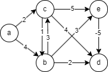
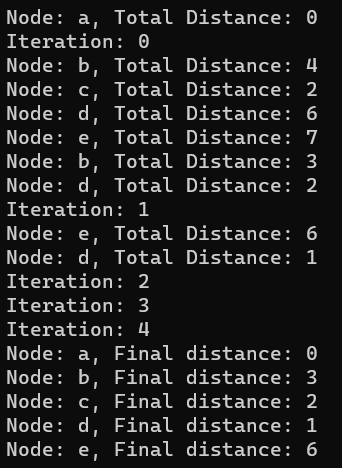

# Bellman-Ford
## The Theory
### What is it?
The Bellman-Ford algorithm is a widely used shortest path algorithm in graph theory and network routing.
It is designed to find the shortest path from a single source node to all other nodes in a weighted graph, even if the graph contains negative edge weights.
The algorithm iteratively relaxes the edges in the graph to progressively improve the estimated distance values until it reaches the optimal shortest paths.
### When should it be used?
The Bellman-Ford algorithm is suitable for scenarios where the graph may contain negative edge weights or cycles.
It is commonly used in network routing protocols, where it can handle various types of routing and update the shortest path when the network topology changes dynamically.
### When should it not be used?
Bellman-Ford might not be the best choice for graphs without negative edge weights or cycles.
In such cases, other algorithms like Dijkstra's algorithm or A* may be more efficient and suitable for finding the shortest path.
Bellman-Ford's time complexity (O(V*E), where V is the number of vertices and E is the number of edges) also makes it less efficient for large graphs, and in such cases, more specialized algorithms might be preferred.
### What are the common pitfalls of this approach?
Some common pitfalls of using the Bellman-Ford algorithm include:
* Slow Convergence: The Bellman-Ford algorithm may require many iterations to converge, especially in graphs with negative cycles or distant source nodes.
* Negative Cycle Detection: The algorithm does not terminate successfully if the graph contains a negative cycle reachable from the source node. In such cases, the algorithm cannot provide reliable shortest path information.
* Large Graphs: For very large graphs, Bellman-Ford's time complexity can be a significant drawback, and alternative algorithms with better time complexity may be preferred.
## The Practice
### Sample Project
This sample project structures a graph as in the diagram:

The order of traversal is as shown below:

