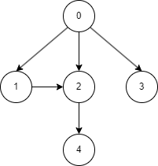

# Depth-First Search
## The Theory
### What is it?
The Depth-First Search (DFS) algorithm is a graph traversal technique used to explore a graph or tree data structure deeply before backtracking.
It starts from a specified source node and explores as far as possible along each branch before backtracking to the previous node and continuing to explore other branches.
DFS is implemented using a stack data structure or recursion.
### When should it be used?
DFS is ideal for exploring all possible paths in a graph or tree, especially in cases where finding a path to the end or a specific goal is the primary objective.
It is commonly used in maze-solving, topological sorting, and detecting cycles in a graph.
### When should it not be used?
DFS might not be the best choice when you need to find the shortest path or explore all reachable nodes in an unweighted graph.
It does not guarantee the shortest path, and in some cases, it may get stuck exploring an infinitely deep branch or cycle, leading to non-termination.
For these situations, Breadth-First Search or Dijkstra's algorithm might be more appropriate.
### What are the common pitfalls of this approach?
Some common pitfalls of using the DFS algorithm include:
* Non-Termination: DFS can get trapped in infinite loops if the graph contains cycles or if there are infinitely deep branches. Proper cycle detection or depth limits need to be implemented to avoid non-termination.
* Memory Consumption: Recursive DFS can consume a large amount of memory in deep graphs or trees due to the recursive call stack. For very deep or large structures, iterative DFS using a stack might be preferred.
* Lack of Optimal Solution: DFS does not guarantee the shortest path to a target node, making it less suitable for finding the optimal solution in certain applications.
## The Practice
### Sample Project
This sample project structures a graph as in the diagram:

The order of traversal is `0, 1, 2, 4, 3`.
